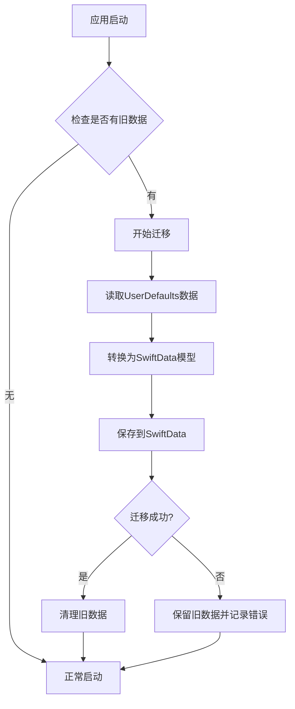

# SwiftData迁移设计文档

## 概述

本设计文档详细描述了将AlarmClock应用从UserDefaults迁移到SwiftData的技术实现方案。SwiftData是iOS 17+的现代数据持久化框架，提供了声明式API、类型安全和自动数据同步功能。

## 架构设计

### 整体架构

```
┌─────────────────────────────────────────────────────────────┐
│                    SwiftUI Views                            │
├─────────────────────────────────────────────────────────────┤
│  @Query Properties  │  @Environment(\.modelContext)        │
├─────────────────────────────────────────────────────────────┤
│                  AlarmManager                               │
│              (Business Logic)                               │
├─────────────────────────────────────────────────────────────┤
│                  SwiftData Layer                            │
│  ModelContext  │  ModelContainer  │  @Model Classes        │
├─────────────────────────────────────────────────────────────┤
│                  SQLite Database                            │
└─────────────────────────────────────────────────────────────┘
```

### 数据流设计

1. **读取流程**: View → @Query → SwiftData → SQLite
2. **写入流程**: View → AlarmManager → ModelContext → SwiftData → SQLite
3. **自动更新**: SQLite → SwiftData → @Query → View (自动刷新)

## 数据模型设计

### 核心数据模型

#### 1. Alarm模型

```swift
@Model
final class Alarm {
    @Attribute(.unique) var id: UUID
    var time: Date
    var label: String
    var isEnabled: Bool
    var sound: String
    var snoozeEnabled: Bool
    var vibrationEnabled: Bool
    var createdAt: Date
    var updatedAt: Date
    
    // 关系属性
    @Relationship(deleteRule: .cascade, inverse: \AlarmRepeat.alarm)
    var repeatDays: [AlarmRepeat] = []
    
    @Relationship(deleteRule: .nullify, inverse: \AlarmTemplate.alarms)
    var template: AlarmTemplate?
    
    init(time: Date = Date(), label: String = "闹钟", isEnabled: Bool = true, 
         sound: String = "默认", snoozeEnabled: Bool = true, 
         vibrationEnabled: Bool = true) {
        self.id = UUID()
        self.time = time
        self.label = label
        self.isEnabled = isEnabled
        self.sound = sound
        self.snoozeEnabled = snoozeEnabled
        self.vibrationEnabled = vibrationEnabled
        self.createdAt = Date()
        self.updatedAt = Date()
    }
}
```

#### 2. AlarmRepeat模型

```swift
@Model
final class AlarmRepeat {
    @Attribute(.unique) var id: UUID
    var weekday: Int // 1-7 对应周日到周六
    
    @Relationship var alarm: Alarm?
    
    init(weekday: Int) {
        self.id = UUID()
        self.weekday = weekday
    }
}
```

#### 3. AlarmTemplate模型

```swift
@Model
final class AlarmTemplate {
    @Attribute(.unique) var id: UUID
    var name: String
    var category: String
    var icon: String
    var templateDescription: String
    var time: String
    var frequency: String
    var defaultTime: String
    var repeatType: String
    var scenario: String
    
    @Relationship var alarms: [Alarm] = []
    
    init(name: String, category: String, icon: String, 
         templateDescription: String, time: String, frequency: String,
         defaultTime: String, repeatType: String, scenario: String) {
        self.id = UUID()
        self.name = name
        self.category = category
        self.icon = icon
        self.templateDescription = templateDescription
        self.time = time
        self.frequency = frequency
        self.defaultTime = defaultTime
        self.repeatType = repeatType
        self.scenario = scenario
    }
}
```

### Schema配置

```swift
let schema = Schema([
    Alarm.self,
    AlarmRepeat.self,
    AlarmTemplate.self
])

let modelConfiguration = ModelConfiguration(
    schema: schema,
    isStoredInMemoryOnly: false,
    allowsSave: true
)
```

## 组件设计

### 1. DataManager (数据管理器)

```swift
@Observable
final class DataManager {
    private let modelContext: ModelContext
    
    init(modelContext: ModelContext) {
        self.modelContext = modelContext
    }
    
    // CRUD操作
    func save() throws
    func fetch<T: PersistentModel>(_ type: T.Type) throws -> [T]
    func insert<T: PersistentModel>(_ object: T)
    func delete<T: PersistentModel>(_ object: T)
}
```

### 2. MigrationManager (迁移管理器)

```swift
final class MigrationManager {
    static func migrateFromUserDefaults(to context: ModelContext) async throws
    static func hasLegacyData() -> Bool
    static func cleanupLegacyData()
    private static func convertLegacyAlarm(_ data: Data) throws -> Alarm
}
```

### 3. AlarmManager重构

```swift
@Observable
final class AlarmManager {
    private let modelContext: ModelContext
    
    init(modelContext: ModelContext) {
        self.modelContext = modelContext
    }
    
    func addAlarm(_ alarm: Alarm) throws
    func updateAlarm(_ alarm: Alarm) throws
    func deleteAlarm(_ alarm: Alarm) throws
    func toggleAlarm(_ alarm: Alarm, enabled: Bool) throws
}
```

## 视图层集成

### 1. App入口配置

```swift
@main
struct AlarmClockApp: App {
    let container: ModelContainer
    
    init() {
        do {
            container = try ModelContainer(for: Alarm.self, AlarmRepeat.self, AlarmTemplate.self)
        } catch {
            fatalError("Failed to create ModelContainer: \(error)")
        }
    }
    
    var body: some Scene {
        WindowGroup {
            ContentView()
                .modelContainer(container)
                .task {
                    await performInitialMigration()
                }
        }
    }
}
```

### 2. 视图中的数据查询

```swift
struct AlarmListView: View {
    @Query(sort: \Alarm.time) private var alarms: [Alarm]
    @Environment(\.modelContext) private var modelContext
    
    var body: some View {
        List {
            ForEach(alarms) { alarm in
                AlarmRowView(alarm: alarm)
            }
            .onDelete(perform: deleteAlarms)
        }
    }
    
    private func deleteAlarms(offsets: IndexSet) {
        for index in offsets {
            modelContext.delete(alarms[index])
        }
        try? modelContext.save()
    }
}
```

### 3. 复杂查询示例

```swift
struct ScenarioAlarmsView: View {
    let scenario: String
    
    @Query private var alarms: [Alarm]
    
    init(scenario: String) {
        self.scenario = scenario
        let predicate = #Predicate<Alarm> { alarm in
            alarm.template?.scenario == scenario
        }
        _alarms = Query(filter: predicate, sort: \Alarm.time)
    }
}
```

## 数据迁移策略

### 迁移流程



### 迁移实现

```swift
extension MigrationManager {
    static func migrateFromUserDefaults(to context: ModelContext) async throws {
        guard hasLegacyData() else { return }
        
        // 读取旧数据
        guard let data = UserDefaults.standard.data(forKey: "SavedAlarms"),
              let legacyAlarms = try? JSONDecoder().decode([LegacyAlarm].self, from: data) else {
            throw MigrationError.invalidLegacyData
        }
        
        // 转换并保存
        for legacyAlarm in legacyAlarms {
            let alarm = convertLegacyAlarm(legacyAlarm)
            context.insert(alarm)
        }
        
        try context.save()
        
        // 清理旧数据
        cleanupLegacyData()
    }
}
```

## 性能优化

### 1. 查询优化

- 使用适当的索引：`@Attribute(.unique)`用于ID字段
- 批量操作：使用`ModelContext.processPendingChanges()`
- 延迟加载：使用`@Relationship`的延迟加载特性

### 2. 内存管理

```swift
// 后台操作使用独立的ModelContext
func performBackgroundTask() {
    let backgroundContext = ModelContext(container)
    // 执行操作
    try? backgroundContext.save()
}
```

### 3. 查询缓存

```swift
// 使用@Query的自动缓存机制
@Query(sort: \Alarm.time) private var alarms: [Alarm]
```

## 错误处理

### 错误类型定义

```swift
enum SwiftDataError: LocalizedError {
    case migrationFailed(Error)
    case saveFailed(Error)
    case fetchFailed(Error)
    case constraintViolation(String)
    
    var errorDescription: String? {
        switch self {
        case .migrationFailed(let error):
            return "数据迁移失败: \(error.localizedDescription)"
        case .saveFailed(let error):
            return "保存数据失败: \(error.localizedDescription)"
        case .fetchFailed(let error):
            return "获取数据失败: \(error.localizedDescription)"
        case .constraintViolation(let message):
            return "数据约束违反: \(message)"
        }
    }
}
```

### 错误处理策略

1. **数据操作错误**: 使用try-catch包装，提供用户友好的错误信息
2. **迁移错误**: 保留原数据，记录错误日志
3. **约束违反**: 提供数据验证和修复建议
4. **存储空间不足**: 提供清理建议和存储状态信息

## 测试策略

### 1. 单元测试配置

```swift
class SwiftDataTestCase: XCTestCase {
    var container: ModelContainer!
    var context: ModelContext!
    
    override func setUp() {
        super.setUp()
        
        let config = ModelConfiguration(isStoredInMemoryOnly: true)
        container = try! ModelContainer(for: Alarm.self, configuration: config)
        context = ModelContext(container)
    }
}
```

### 2. 迁移测试

```swift
func testMigrationFromUserDefaults() async throws {
    // 准备旧数据
    let legacyData = createLegacyTestData()
    UserDefaults.standard.set(legacyData, forKey: "SavedAlarms")
    
    // 执行迁移
    try await MigrationManager.migrateFromUserDefaults(to: context)
    
    // 验证结果
    let alarms = try context.fetch(FetchDescriptor<Alarm>())
    XCTAssertEqual(alarms.count, expectedCount)
}
```

### 3. 性能测试

```swift
func testLargeDatasetPerformance() {
    measure {
        // 创建大量数据并测试查询性能
        let alarms = try! context.fetch(FetchDescriptor<Alarm>())
        XCTAssertGreaterThan(alarms.count, 1000)
    }
}
```

## 部署考虑

### 1. 版本兼容性

- 最低支持iOS 17.0（SwiftData要求）
- 向后兼容处理：为iOS 16及以下版本保留UserDefaults实现

### 2. 数据库版本管理

```swift
// 使用Schema版本控制
let schemaV1 = Schema([Alarm.self], version: .init(1, 0, 0))
let schemaV2 = Schema([Alarm.self, AlarmTemplate.self], version: .init(1, 1, 0))
```

### 3. 监控和日志

- 添加数据操作日志
- 监控迁移成功率
- 性能指标收集

## 实施计划

1. **阶段1**: 创建SwiftData模型和基础架构
2. **阶段2**: 实现数据迁移逻辑
3. **阶段3**: 重构AlarmManager和视图层
4. **阶段4**: 测试和性能优化
5. **阶段5**: 部署和监控