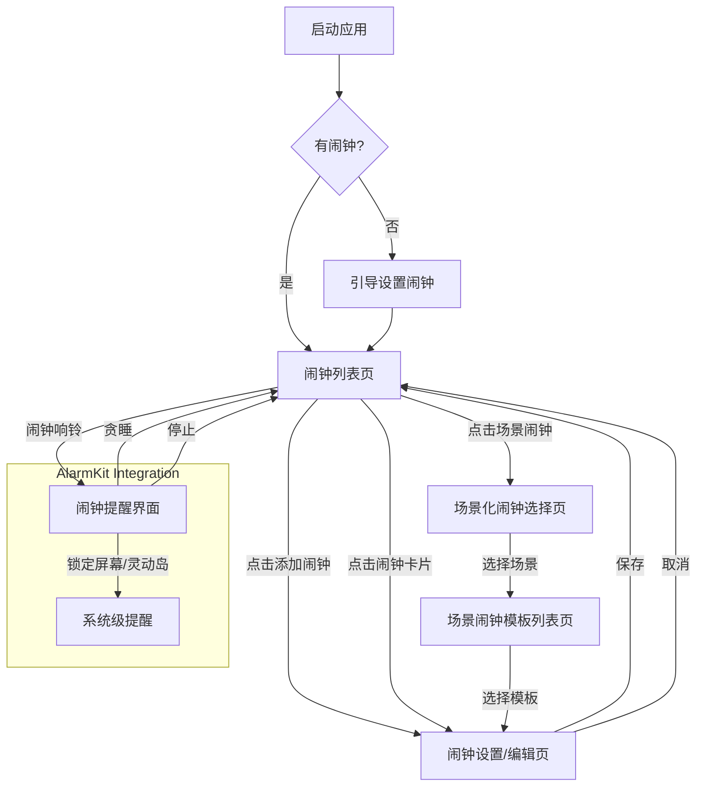

# 原型设计与交互流程

## 1. 设计理念

本应用的原型设计将遵循 iOS 平台的设计规范，以简洁、直观、高效为核心原则。界面将采用扁平化设计风格，注重信息层级和视觉引导，确保用户能够快速理解和操作。色彩搭配将以柔和、舒适为主，同时通过高对比度确保可读性。交互流程将力求流畅自然，减少用户的认知负担和操作步骤。

## 2. 关键屏幕设计

### 2.1. 闹钟列表页 (Alarm List View)

*   **布局**：采用列表形式展示所有已设置的闹钟，每个闹钟占据一行，清晰显示闹钟时间、标签、重复周期和开关状态。
*   **元素**：
    *   **顶部导航栏**：包含“编辑”按钮（用于批量管理闹钟）和“添加”按钮（+）。
    *   **闹钟卡片/行**：
        *   **时间显示**：大字体显示闹钟时间，例如“07:30 AM”。
        *   **标签/名称**：显示用户设置的闹钟标签，例如“上班提醒”、“喝水”。
        *   **重复周期**：显示闹钟的重复周期，例如“每天”、“周一至周五”、“一次性”。
        *   **开关**：用于快速开启/关闭闹钟的 Toggle 开关。
        *   **下次响铃时间**：在闹钟关闭时，显示下次响铃的日期和时间。
*   **交互**：
    *   点击闹钟卡片进入闹钟详情/编辑页。
    *   滑动闹钟卡片可显示“删除”选项。
    *   点击顶部“添加”按钮进入闹钟设置页。

### 2.2. 闹钟设置/编辑页 (Alarm Setup/Edit View)

*   **布局**：采用表单形式，分区域展示闹钟的各项设置。
*   **元素**：
    *   **顶部导航栏**：包含“取消”按钮和“保存”按钮。
    *   **时间选择器**：大尺寸滚轮式时间选择器，方便用户精确选择时间。
    *   **闹钟标签输入框**：文本输入框，用于输入闹钟名称或标签。
    *   **重复周期设置**：进入新页面选择重复周期（一次性、每天、每周特定几天、每月、每年）。
    *   **铃声选择**：进入新页面选择内置铃声或自定义铃声。
    *   **贪睡时长设置**：滚轮选择器或预设选项，选择贪睡时长。
    *   **音量调节滑块**：调节闹钟音量。
    *   **删除闹钟按钮**：在编辑模式下显示。
*   **交互**：
    *   用户通过点击、滑动等手势进行各项设置。
    *   点击“保存”按钮保存闹钟并返回闹钟列表页。
    *   点击“取消”按钮放弃设置并返回闹钟列表页。

### 2.3. 场景化闹钟选择页 (Scenario Alarm Selection View)

*   **布局**：采用网格或列表形式展示十大生活场景图标和名称。
*   **元素**：
    *   **顶部导航栏**：包含“返回”按钮和页面标题“选择生活场景”。
    *   **场景卡片**：每个卡片包含场景图标和场景名称（例如：工作、学习、健康）。
*   **交互**：
    *   点击任一场景卡片进入该场景下的闹钟模板列表页。

### 2.4. 场景闹钟模板列表页 (Scenario Template List View)

*   **布局**：列表形式展示所选场景下的所有预设闹钟模板。
*   **元素**：
    *   **顶部导航栏**：包含“返回”按钮和场景名称。
    *   **模板卡片**：每个卡片显示模板名称和简要描述（例如：“会议提醒 - 提前15分钟”、“番茄工作法 - 25分钟工作”）。
*   **交互**：
    *   点击任一模板卡片，自动填充闹钟设置页的相应字段，用户可在此基础上进行微调并保存。

### 2.5. 闹钟提醒界面 (Alarm Alert View)

*   **布局**：全屏显示，突出闹钟信息和操作按钮。
*   **元素**：
    *   **闹钟时间**：大字体显示当前闹钟时间。
    *   **闹钟标签**：显示闹钟名称或标签。
    *   **铃声动画/视觉效果**：可选的视觉反馈，如波纹、光晕等。
    *   **操作按钮**：
        *   **贪睡 (Snooze)**：点击后闹钟在贪睡时长后再次响铃。
        *   **停止 (Stop)**：点击后关闭当前闹钟。
*   **交互**：
    *   闹钟响铃时，界面自动弹出。
    *   用户可点击“贪睡”或“停止”按钮进行操作。
    *   在锁定屏幕和灵动岛上，以系统原生样式显示。

## 3. 交互流程图 (高层级)

## 4. 视觉风格初步建议

*   **色彩**：
    *   主色调：柔和的蓝色或绿色，营造平静和放松的氛围。
    *   辅助色：少量亮色用于强调重要信息或交互元素。
    *   背景色：浅色系，如浅灰、米白，保持界面整洁。
*   **字体**：
    *   采用 iOS 系统默认字体（San Francisco），确保系统一致性和最佳可读性。
    *   闹钟时间使用粗体大字号，突出显示。
*   **图标**：
    *   采用扁平化、线条简洁的图标风格。
    *   场景图标应具有辨识度，能直观表达场景含义。
*   **布局**：
    *   留白充足，避免界面拥挤。
    *   卡片式设计，增强信息分组和视觉焦点。

## 5. 待定事项

*   具体图标设计。
*   自定义铃声导入的 UI 流程。
*   实时活动 (Live Activities) 的具体设计细节。
*   多语言支持的界面适配。

